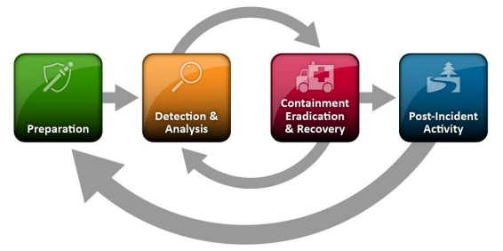

# Bienvenue dans l'Investigation Numérique et Réponse aux Incidents

Si vous êtes nouveau dans le domaine du ***[DFIR (Digital Forensic and Incident Response)](https://www.crowdstrike.com/cybersecurity-101/digital-forensics-and-incident-response-dfir/)*** et vous ne savez pas par où commencer, alors ce blog est le vôtre ! 

Vous ou certainement l’un de vos proches a déjà été piraté et vous vous demandiez comment cela est-il arrivé ? Ou encore vous avez vu dans les journaux qu’une entreprise ou un hôpital a été victime d’une **[cyberattaque](https://fr.wikipedia.org/wiki/Cyberattaque)** et vous aimeriez savoir comment ces entreprises et hôpitaux font face à la crise cyber, comment font-ils pour sortir de cette même crise et surtout comment font-ils pour suivre les traces des attaquants afin d’attribuer l’attaque dont ils font face à un groupe d’attaquant communément appelé **[APT (Advanced Persistent Threat)](https://fr.wikipedia.org/wiki/Advanced_Persistent_Threat)** ?  Eh bien vous trouverez la réponse à ces questions ici. 

Avant de commencer, laissez-moi vous rassurer qu’en **2020**, je me posais exactement les mêmes questions et je me demandais : 

- A quel moment peut-on affirmer que nous faisons face à une attaque informatique ? 
- Comment les enquêteurs font-ils pour avoir des preuves d'une attaque informatique ? 
- Comment ces même enquêteurs peuvent-ils s'assurer de l'exactitude et de la fiabilité des informations provenant des sources numériques telles qu'une **RAM**, un **disque dur** ou tout autre [**artefact**](https://www.journaldunet.fr/web-tech/dictionnaire-du-webmastering/1445256-artefact-en-informatique-definition-et-role/) pour attribuer une **attaque informatique** à un groupe d'attaquants ou encore à un pays à la suite d'une investigation numérique ?
- Comment savent-ils depuis qaund l’attaquant s’est infiltré dans un réseau informatique ? 
- Comment savent-ils quels chemins l’attaquant a-t-il emprunté ? 
- Comment font-ils pour avoir une chronologie des événement ?
- Est-ce que c’est l’attaquant qui leur dit tout ce qu’il a fait ? etc…

Bon, vous l’aurez compris… j’avais autant de questions de **comment, Qui, Pourquoi, Quand,** etc. Pour répondre à ces questionnement, je suis allé à la quête des réponses et c’est là que j’ai découvert le monde de [**l’investigation numérique et la réponse aux incidents**](https://www.crowdstrike.com/cybersecurity-101/digital-forensics-and-incident-response-dfir/) qui est tout de suite devenu une passion pour moi. 

## Mais que veut dire " investigation numérique et la réponse aux incidents ? "

L’investigation numérique et la réponse aux incidents sont deux domaines de la cybersécurité couvrant l’**identification**, la **collecte** et l’**investigation** des **artefacts** suite à un incident de sécurité. Evidemment, ces deux domaines sont étroitement liés mais restent distincts.

1. **Investigation numérique (Forensic)** : consiste en l’application de processus et techniques d’investigation permettant de collecter et d’analyser des [**empreintes numériques**](https://www.kaspersky.fr/resource-center/definitions/what-is-a-digital-footprint) laissées sur des supports numériques afin d'identifier des preuves dans le cadre d'une enquête judiciaire ou encore dans le cadre d’une reconstitution des faits à la suite d'un incident de sécurité ou d'une attaque informatique. 

2. **Réponse aux incidents** : regroupe l’ensemble des actions mises en œuvre pour **prévenir**, **détecter**, **confiner** et **répondre** aux **cybermenaces**. 

En cas de suspicion d'activités malveillantes ou d'attaques informatiques au sein d'un [**système d'information**](https://fr.wikipedia.org/wiki/Syst%C3%A8me_d'information), un [**analyste de réponse aux incidents de sécurité**](https://guardia.school/metiers/analyste-en-reponse-a-incidents.html) analyse les alertes et réalise une analyse technique du même [**SI**](https://fr.wikipedia.org/wiki/Syst%C3%A8me_d'information) pour comprendre le **pourquoi** du **comment**. 
Il se doit **identifier** le **mode opératoire** des attaquants afin de qualifier l’étendue d’une potentielle **compromission**. Pour ce faire, il doit avoir une bonne compréhension de comment  opèrent les attaquants pendant toutes les étapes de la [**Kill Chain**](https://www.netskope.com/fr/security-defined/cyber-security-kill-chain). Il doit également avoir une bonne connaissance des [**tactiques, techniques et procédures**](https://tehtris.com/fr/blog/glossaire/ttps-tactiques-techniques-et-procedures) utilisées par des attaquants.

## Objectifs de l'investigation numérique et de la réponse aux incidents de sécurité

L’objectif principal d’une [**investigation numérique**](https://fr.wikipedia.org/wiki/Informatique_l%C3%A9gale) est d’enquêter sur les **empreintes numériques** laissées sur les appareils électroniques tels que des **ordinateurs**, des **tablettes**, des **téléphones portables** ou de tout autre appareil informatique capable de stocker/traiter des données numériques et d'en extraire des preuves numériques. Cependant, les objectifs d'une investigation numérique peuvent inclure :

- **La collecte de preuves** : cette phase permet de collecter des preuves numériques pertinentes tout en préservant leur intégrité. Cette **phase** reste **cruciale**, car toute la suite d'une investigation numérique en dépend. Une fois les preuves altérées, elles deviennent inexploitables.
- **L’analyse de preuves** : une fois les preuves collectées, celles-ci doivent être analysées pour trouver des informations pertinentes qui pourraient aider à résoudre l’incident de sécurité en cours. 
- **L’identification de potentiels suspects** : les informations pertinentes obtenues suite à l’analyse des preuves numériques peuvent aider les enquêteurs à identifier de potentiels suspects à travers leurs signatures afin d’attribuer l’action malveillante à son potentiel initiateur. 
- **La prévention de nouvelles attaques** : le résultat d’une investigation numérique peut également servir à prévenir de futures cyberattaques en identifiant les vulnérabilités du système informatique et en fournissant des remédiations.

## Méthologie d'une investigation numérique 

Comme évoqué plus haut, **l’investigation numérique et la réponse aux incidents** sont étroitement liées, car elles couvrent l’**identification**, la **collecte** et l’**investigation** des d’artefacts à la suite d’un incident de sécurité. Cependant, une certaine norme doit être respectée pour faire face et pour répondre à un incident informatique. Selon le [**NIST (National Institute of Standards and Technology)**](https://fr.wikipedia.org/wiki/National_Institute_of_Standards_and_Technology), une réponse aux incidents de sécurité peut se décompose en **4 phases principales** ([Guide NIST](https://nvlpubs.nist.gov/nistpubs/SpecialPublications/NIST.SP.800-61r2.pdf)) :

1-	**Préparation** : comme son nom l'indique, c'est la phase de **préparation** et **d'anticipation** aux incidents de sécurité. Cette étape permet de **prévenir** et de **répondre** aux **incidents de sécurité**. Pour ce faire, il faut en amont **former** et **sensibiliser** les équipes et mettre en place des **[systèmes de détection et protection](https://www.varonis.com/fr/blog/ids-et-ips-en-quoi-sont-ils-differents)** adéquats. Rien de mieux que l’anticipation, car on sera tôt ou tard attaqué. 

2-	**Détection et analyse** : à travers les règles de détection mises en place dans des organisation, des alertes de sécurité sont déclenchées en cas suspicion d’incident. A la suite de ce déclenchement, une analyse est ensuite menée pour détecter les faux positifs afin de les classifier. 

3-	**Confinement, éradication et rétablissement** : cette phase vise à limiter au maximum les potentiels impacts que peut causer un incident de sécurité, en essayant d’atténuer les interruptions de service. L’objectif principal de cette phase est de confiner l’incident, pour ensuite investiguer afin de l’anéantir.

4-	**Activité post-incident** : à la suite de l'incident, un **retour d'expérience** peut être nécessaire pour identifier l'ensemble des difficultés rencontrées au cours de l'activité. Cela peut aider à prevenir de futurs incidents et cela pourra également permettre à l'équipe de réponse aux incidents de mieux se préparer et de limiter les risques que l'incident ne se reproduise.

Ci-dessous un diagramme explicatif du cycle de vie d'une réponse aux incidents selon le **NIST** :

<figure>

        <figcaption>
 
Cycle de vie d'une réponse aux incidents (image source :<a href="https://nvlpubs.nist.gov/nistpubs/SpecialPublications/NIST.SP.800-61r2.pdf"> NIST</a>)

</figcaption>

</figure>

## Qu'est-ce qu'une preuve numérique ?

Une [**preuve numérique**](https://digital-solutions.konicaminolta.fr/gestion-documentaire/article-preuve-numerique-les-regles-a-respecter/) est tout élément de preuve obtenu à partir d'une **source électronique** telle que (un **ordinateur**, un **appareil mobile**, un **système de surveillance**, un **réseau informatique**, une **communication électronique, etc.**), pouvant être utilisée pour établir les faits dans une enquête ou une affaire judiciaire.

## Les Types de preuves numériques

Les preuves numériques peuvent prendre différentes formes : 

- courriels
- documents électroniques
- données crées par des utilisateurs (fichiers texte, documents MS Office, fichiers multimédias, etc.)
- enregistrements audio/vidéo
- fichiers système
- historiques de navigation des utilisateurs
- images numériques
- journaux d'activité
- etc.

L'ensemble de ces preuves numériques restent accessibles par un enquêteur / investigateur numérique. Cependant, l'emplacement de ces derniers diffèrent d'un appareil à un autre et l’acquisition de chacune d’elles nécessite des méthodologies et outils différents. 

## Acquisition de données et preuves numériques

L'**acquisition** consiste à faire une copie d'un élément de **preuve numérique**, qui peut être n'importe quel type de support (Disque Dur, RAM, USB, CD, etc.). Cette phase d’acquisition reste l’une des phases les plus cruciales d’une **investigation numérique**, car elle permet de prélever (collecter) l’ensemble des preuves numériques à partir des supports numériques. Pour ce faire, les **preuves numériques** ne doivent pas être altérées. 

Il existe **2 types** d'acquisition des données (**statique** et **dynamique**). De plus, aucours de cette même phase d'acquisition, nous pouvons également rencontrer **2 types de données** :

- données volatiles
- données non volatiles

## Les types d'acquisition 

Il existe **2 types** d'acquisition :

- **Acquisition statique** : consiste à recueillir des données non volatiles. Ce type d'acquisition est généralement réalisé sur des disques durs et tout autre support numérique pouvant sauvegarder des données même quand il n'est pas en état de fonctionnement.
- **Acquisition dynamique** : consiste à collecter des données volatiles, généralement lorsque l'appareil est encore en fonctionnement. Ce type d'acquisition est réalisé sur des RAM. Aucours de cette phase, l'investigateur numérique doit être **extrêmement prudent** pour ne pas perdre l'ensemble des preuves ou les altérer.

## Les types de données

Aucours d'une investigation numérique, nous serons amenés à investiguer sur **2 types de données** : les données volatiles et non volatiles.

- **Données volatiles** : sont des données qui peuvent changer ou potentiellement être supprimées sur un support numérique à la suite d'un changement bursque de son état actuel. Par exemple, les données d'une RAM sont volatiles et peuvent être supprimées à travers un simple redémarrage de l'odrinateur. 

- **Données non volatiles** : contrairement aux données volatiles, l'état actuel des données non volatiles ne peut changé que par une action utilisateur. Par exemple, un disque dur a des données non volatiles, car le simple redémarrage de l'ordinateur n'impact en aucun cas celles-ci. 

## Types de fichiers
*
ddddd
d
d
d
d

## Formats des fichiers

- **Format RAW**

Lors d'une investigation numérique, le format de fichier le plus utilisé est le format **brut** (**raw** en anglais). Ce format est généralement rencontré dans les copies d'une mémoire volatilre (RAM), dans le cadre l'acquisition de celle-ci. Il est également rencontré lors d'une copie bit à bit des données brutes d'un disque dur.

En effet, le format **raw** permet de créer une copie complète du disque ou d'une seule partition à l'intérieur de celui-ci. Les principaux avantages de ce format résident dans sa capacité à ignorer les erreurs de lecture mineures du disque source, ainsi que dans la rapidité du transfert des données. De plus, le format **raw** est pris en charge par la plupart des logiciels d'investigation et il est le format de fichier par défaut pour la sortie générée par la célèbre commande "**dd**" bien connue des systèmes Linux/UNIX. Il existe plusieurs variantes de dénominations pour le format **raw**, telles que : **raw**, **imag**, **dd**, **001** et **dmg**.  

Bien que le format **raw** présente d'énormes avantages, il convient de noter que son principal inconvénient est qu'il nécessite le même **espace de stockage** que le disque source, car il n'est pas possible de **compresser** les données lorsqu'elles sont au format **raw**, ce qui peut poser un problème lors de l'acquisition de disques durs de grande taille.

- **AFF (Advanced Forensic Format)**