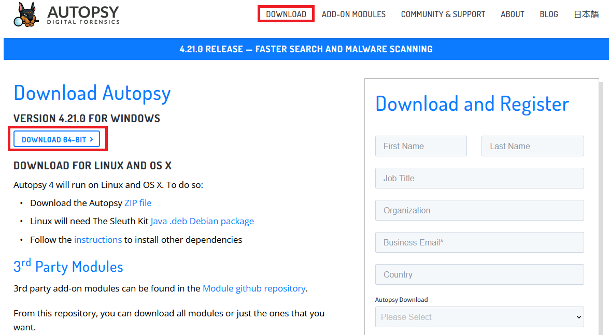

# Bienvenue dans Autopsy 

Vous avez été contacté pour investiguer sur différents types de sources de données suite à un incident de sécurité mais vous ne savez pas quoi faire ni quel outil utilisé ? Ne vous inquiétez pas, **Autopsy** fera l’affaire !

## Qu’est-ce que Autopsy ? 

[**Autopsy**](https://www.sleuthkit.org/autopsy/) est un outil open source d’investigation numérique utilisé pour examiner les [**systèmes de fichiers**](https://fr.wikipedia.org/wiki/Syst%C3%A8me_de_fichiers) et les [**disques durs**](https://fr.wikipedia.org/wiki/Disque_dur), ainsi que pour récupérer des données sur les disques **Autopsy** est principalement utilisé sur les systèmes **Windows**, cependant il support également les systèmes **Linux** et **MacOs**. 

**Autopsy** reste un outil d'investigation extrêmement puissant avec des fonctionnalités énormes. 

## Fonctionnalités d’Autopsy  

**Autopsy** regroupe plusieurs fonctionnalités à son actif : 

- **Analyse de plusieurs systèmes de fichiers** : il estcapable d’analyser les systèmes de fichiers couramment utilisés tels que :NTFS, FAT, exFAT, HFS+, EXT2/3/4
- 

## Installation d'Autopsy sur Windows

Pour installer **autopsy** sur **Windows** il faut se rendre sur sa [**page officielle de téléchargement**](https://www.autopsy.com/download/) et télécharger la version correspondant à votre systèmes.

## Installation d'autopsy sous Windows 

**Coming soon.........**

## Installation d'autopsy sous Linux

**Coming soon.........**