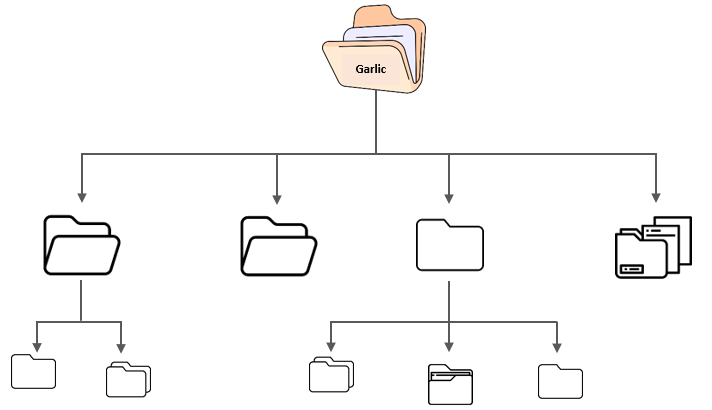
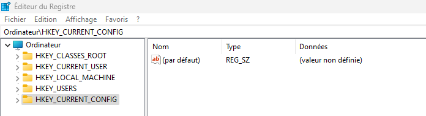

# Bienvenue sur Forensic Windows 101 

Dans ce chapitre, nous parlerons de (**l'investigation numérique sur les environnement Windows**). Comme vu dans le chapitre [Digital Forensic et Réponse aux Incidents](../../DFIR/index.md), **l'investigation numérique (Forensic)** consiste à utiliser des techiniques spécialisées dans la recherche, la collecte et l'analyse de données issues de supports numériques. Lorsqu'une entreprise est compromise due à une attaque informatique, les impacts peuvent être multiples : 

- Financier
- Juridique
- Oganisationnel
- Opérationnel
-  ou encore l'atteinte à sa réputation

Selon les statistiques, les systèmes **Windows** sont les **plus répandus en entreprise** notamment ([**l'Active Directory**](https://fr.wikipedia.org/wiki/Active_Directory)) qui est une solution de Microsoft permettant de gérer des parcs informatiques d’entreprises de toutes tailles. Il est utilisé par des entreprise pour gérer les demandes d’authentification et contrôle des utilisateurs, postes de travail, serveurs, etc.

Lors d'une attaque informatique, une fois qu'un attaquant est infiltré dans le réseau d'entreprise, son objectif principal serait de compromettre le [**contrôleur de domaine**](https://en.wikipedia.org/wiki/Domain_controller) de l'entreprise en essayant par tous les moyens de devenir **Administrateur du domaine**. Dès lors qu'il réussit cette étape, il essayera de maintenir son accès et de prendre en otage une bonne partie si ce n'est toutes les ressources nécessaires ou sensibles d'une entreprise via la demande d'une [**rançon**](https://fr.wikipedia.org/wiki/Ran%C3%A7ongiciel) sous peine de suppression voire divulgation de ces dernières. 

C'est pourquoi il est plus qu'important pour un **investigateur** de comprendre le fonctionnement d'un système **Windows** et sa [**base de registre**](https://fr.wikipedia.org/wiki/Base_de_registre) afin de mieux gérer son investigation suite à la compromission d'un **environnement Windows**. Avant d'aller plus loin, nous allons faire un petit récap du fonctionnement d'un environnement Windows.

## Les systèmes de fichiers Windows

[**Un système de fichiers**](https://fr.wikipedia.org/wiki/Syst%C3%A8me_de_fichiers) (file system en anglais) est une structure de données permettant de stocker et d'organiser des informations dans des fichiers sur un stockage dit secondaire (disque dur, disquette, CD-ROM, clé USB, etc.) d'un système d'exploitation. 
<figure>

        <figcaption>Système de fichiers</figcaption>
</figure>

Les systèmes d'exploitation **Windows** regroupe différents types de systèmes de fichiers. 

###  Les systèmes de fichiers FAT 

Le système de fichiers [FAT (File Allocation Table)](https://fr.wikipedia.org/wiki/File_Allocation_Table) est un système de fichiers développé par Microsoft pour les disques durs, les disques externes, les clés USB et d'autres types de supports de stockage. Il a été conçu pour être simple, portable et est utilisé dans les appareils électroniques tels que les caméras numériques, les lecteurs MP3 ou encore les téléphones portables. Il utilise une table d'allocation des fichiers pour suivre l'emplacement de chaque fichier sur le disque et permet de stocker des fichiers de toutes tailles en utilisant des clusters. Un cluster est une unité de stockage qui peut contenir tout ou partie d'un fichier.

Le système de fichiers FAT est structuré en plusieurs parties:

- **le secteur de démarrage (boot sector)** : c'est le premier secteur du disque, il contient des informations importantes sur la structure du système de fichiers, telles que la taille des clusters et la version du système de fichiers FAT.

- **la table d'allocation des fichiers (FAT)** : c'est une table qui indique si chaque cluster sur le disque est utilisé ou non, ainsi que le cluster suivant dans la chaîne qui compose un fichier.

- **le répertoire racine** : c'est un répertoire spécial qui contient des entrées pour tous les fichiers et dossiers situés à la racine du disque.

- **les fichiers et dossiers** : ce sont les données qu'un utilisateur quelconque stocke sur le disque. Chaque fichier ou dossier est représenté par une ou plusieurs entrées dans la table d'allocation des fichiers et/ou dans le répertoire racine.

- **les entrées de répertoire** : sont des informations sur les fichiers et les dossiers qui se trouvent dans un répertoire particulier, telles que leur nom, leur taille et leur emplacement sur le disque, etc.

<figure>

        <figcaption>
 
Système de fichiers FAT <a href="https://www.easeus.fr/partition-manager-tips/systeme-de-fichier-fat.html">(Image Source)</a>

</figcaption>

</figure>

Différentes variantes du système de fichiers FAT existent :

- Système de Fichiers FAT12 : système de fichiers basé sur 12bits 
- Système de Fichiers FAT16 : systèmes de fichiers basé sur 16bits
- Système de Fichiers FAT32 : systèmes de fichiers basé sur 32bits

### Système de Fichiers exFAT 

[Le système de Fichiers exFAT (Extended File Allocation Table)](https://fr.wikipedia.org/wiki/ExFAT) est un également conçu par Microsoft mais principalement pour les mémoires flash et les supports de stockage externes (disques durs).

###  Système de fichiers NTFS 

[Le système de Fichiers NTFS (New Technology File System)](https://fr.wikipedia.org/wiki/NTFS) est aussi développé par Microsoft pour succéder le système de fichers **FAT**. Il est appelé **système de fichiers journalisé**. Le système de fichiers NTFS offre plusiseurs avantages :

- La journalisation, cest-à-dire qu'il en conserve un journal des modifications apportées aux métadonnées du volume. Cela permet  au système à se remettre d'un crash. Ce journal est stocké dans `$LOGFILE` dans le répertoire racine du volume.
- L'enregistrement des modifications apportées sur un fichier ou même un disque à l'aide de la fonctionnalité ([Shadow Copy](https://fr.wikipedia.org/wiki/Shadow_Copy)). Cela permettra à un utilisateur de restaurer des versions de fichiers précédentes pour la récupération ou la restauration du système. 
- Le contrôle d'accès des répertoires ou fiches et des autorisation pour chaque utilisateur.

####  MFT (Master File Table)

Tout comme pour le système de fichiers FAT, il existe également une table MFT (Master File Table) dans le système de fichiers NTFS. Cette table contient la liste de tous les fichiers stockés dans une partition.

***
Le NTFS en ce qui le concerne permet le cryptage, la compression de fichiers et gère également les autorisations d’accès et les niveaux de droits (permissions).
Le NTFS est plus rapide.

l'utilisation de structures de données avancées pour améliorer les performances, la fiabilité et l'utilisation de l'espace disque, ainsi que des extensions supplémentaires, telles que la liste de contrôle d'accès (ACL) et la journalisation du système de fichiers.

***

 Dans le système de fichiers FAT, les fichiers sont stockés sur le disque dur en clusters. Un cluster est une unité de stockage qui peut contenir tout ou partie d'un fichier. La taille des clusters peut varier en fonction de la version du système de fichiers FAT utilisé.

 La table d'allocation de fichiers (FAT) est un enregistrement de toutes les zones de cluster disponibles et utilisées sur le disque. Il est divisé en entrées, chaque entrée représentant un cluster sur le disque.

**

## Les registres Windows

Les registres Windows sont des bases de données qui stockent des informations de configuration et des paramètres système essentiels pour le fonctionnement du système d'exploitation Windows. Ils contiennent des informations sur les programmes installés, les périphériques matériels, les utilisateurs du système.

Ces registres sont organisés en plusieurs «**Hives**» (ruches en français) et chacune stockant des informations spécifiques :

- HKEY_CLASSES_ROOT
- HKEY_CURRENT_USER
- HKEY_LOCAL_MACHINE
- HKEY_USERS
- HKEY_CURRENT_CONFIG

On peut accéder aux registres Windows via la combinaison de la touche **Win+R** avec la commande : `regedit.exe`

<figure>

        <figcaption>regedit.exe</figcaption>
</figure>

<figure>

        <figcaption>Editeur du registre Windows</figcaption>
</figure>

  
   

